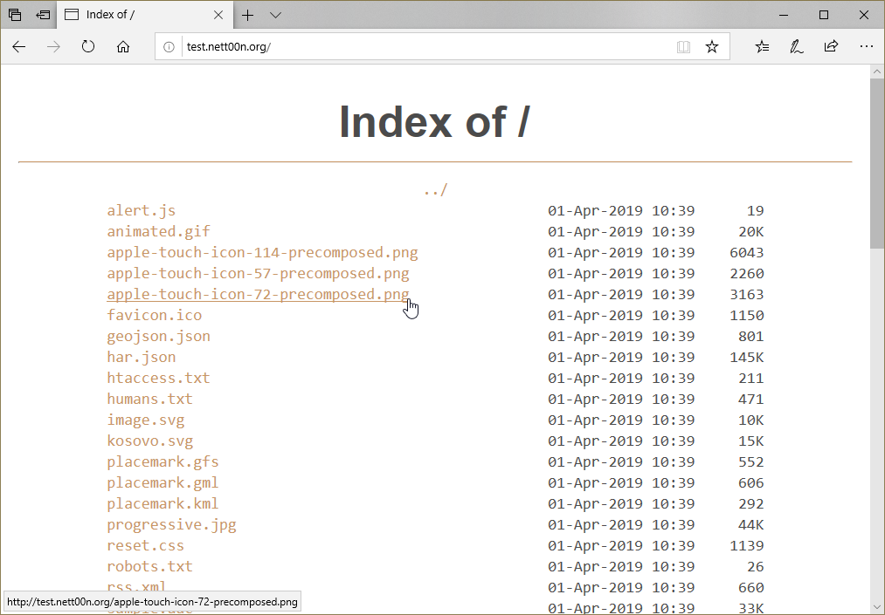

# 3Rubles theme for nginx autoindex

## Dependecies
Theme needs this nginx modules to run:
- ngx_http_autoindex_module
- ngx_http_sub_module

## Installation

If you have your `example.com` site located in `/home/www/example.com/`, then

1. Download theme:

    `git clone https://github.com/nett00n/ngx_autoindex_3rubles /home/www/example.com/.3rubles_theme`
2. Configure your nginx config for site `/etc/nginx/sites-enabled/example.com.conf`:

```
server {
# Your server config:
    listen 80;
    listen [::]:80;
    listen 443;
    listen [::]:443;
    server_name example.com www.example.com;
    root /home/www/example.com;

# Autoindex config:
    autoindex       on;
    autoindex_exact_size off; # Dont show bytes filesize
    add_before_body /.3rubles_theme/header.html; # Include header of theme
    add_after_body /.3rubles_theme/footer.html; #Include footer of theme

# This lines excludes duplicate of tags in page source code:
    sub_filter_once on;
    sub_filter '<html>' '';
    sub_filter '<body bgcolor="white">' '';
    sub_filter '</body>' '';
    sub_filter '</html>' '';

# Show 404 error when file does not exist:
    location / {
            try_files $uri $uri/ =404;
    }

# Use custom 404 page:
    error_page 404 /.3rubles_theme/404.html;
    location = /custom_404.html {
            internal;
    }

}
```

3. Check your nginx config:

    `sudo nginx -t`

4. Reload nginx service:
`sudo service nginx reload`

## Screenshots
- Themed index
    
- Themed 404
    
- Stock index
    
- Stock 404
    


## Credits
Vladimir [nett00n](https://github.com/nett00n) Budylnikov
